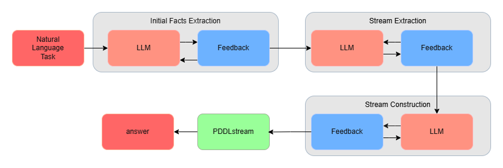

# LLM-PDDLStream Science Solver

This repository is my undergraduate thesis project on solving college-level science word problems by translating natural language into executable `PDDLStream` programs with a large language model.

Instead of asking an LLM to produce a final numeric answer in one shot, this system decomposes the task into symbolic intermediate steps:

1. extract the given facts from the problem statement,
2. generate a stream-level solution procedure, and
3. construct executable `PDDLStream` artifacts (`domain.pddl`, `stream.pddl`, and `run.py`).

The generated program is then executed and automatically graded against SciBench answers.

## Why This Project

Large language models are strong at fluent explanation, but their numerical reasoning can still be unstable. In my thesis, I explored whether we could improve robustness by forcing the model to externalize its reasoning as explicit computational steps and then execute those steps with `PDDLStream`.

This project is a thesis-oriented derivative of [NL2Plan](https://github.com/mrlab-ai/NL2Plan), redesigned for science problem solving rather than classical action planning. The key contribution is extending the text-to-PDDL idea into a pipeline that also generates executable stream definitions and Python computation code.

## System Overview



The pipeline has three stages, each with an LLM feedback loop:

- `Initial Facts Extraction`
  Extracts the quantities and predicates needed for the problem and converts them into initial facts.
- `Stream Extraction`
  Produces a step-by-step computational plan as named streams with formulas, input requirements, and produced facts.
- `Stream Construction`
  Converts each stream into `PDDLStream` declarative definitions and matching Python code.

The generated artifacts are executed by `PDDLStream`, and the final numeric answer is read from `result.json`.

## What The Repository Does

Given a SciBench problem, the repository can:

- read the problem text and required unit,
- generate structured intermediate reasoning instead of a direct answer,
- synthesize `domain.pddl`, `stream.pddl`, and `run.py`,
- execute the generated solver with `PDDLStream`, and
- compare the predicted numeric answer with the gold SciBench answer.

This makes the full reasoning chain inspectable. You can open each task directory and see not only the final answer, but also the extracted facts, generated streams, generated code, and execution logs.

## Main Idea

The core design choice in this project is to treat science problem solving as program synthesis for structured reasoning.

Rather than relying on a single chain-of-thought answer, the system asks the LLM to:

- identify the givens,
- decide what intermediate quantities must be computed,
- name each computation as a stream,
- express stream inputs and outputs symbolically, and
- produce Python code that performs the calculation.

This architecture was motivated by the hypothesis that explicit decomposition would make reasoning more transparent and easier to validate than direct answer generation.

## Evaluation Summary

I evaluated the system on SciBench using `gpt-oss-20b` and compared it against direct Chain-of-Thought prompting.

### Accuracy on SciBench

| Method | atkins | chemmc | quan | matter | fund | class | thermo | diff | stat | calc | Average |
| --- | ---: | ---: | ---: | ---: | ---: | ---: | ---: | ---: | ---: | ---: | ---: |
| CoT | 71.4 | 81.6 | 66.7 | 68.1 | 88.7 | 64.3 | 72.7 | 76.0 | 80.6 | 90.5 | **77.06** |
| Ours | 64.8 | **89.5** | **72.7** | 66.0 | 77.5 | 57.1 | 63.6 | 76.0 | 80.6 | 90.5 | **73.83** |

Observations from the thesis:

- The proposed method did not outperform direct CoT on overall average accuracy.
- It improved performance on some subjects, especially `chemmc` and `quan`.
- It matched CoT on `diff`, `stat`, and `calc`.
- The largest losses appeared in subjects where the generated intermediate solution itself became unstable before execution.

### PDDL Generation Error Rate

| Metric | atkins | chemmc | quan | matter | fund | class | thermo | diff | stat | calc | Total |
| --- | ---: | ---: | ---: | ---: | ---: | ---: | ---: | ---: | ---: | ---: | ---: |
| Total Problems | 105 | 38 | 33 | 47 | 71 | 56 | 66 | 50 | 72 | 42 | 580 |
| Error Count | 0 | 0 | 0 | 1 | 0 | 0 | 1 | 2 | 7 | 1 | 12 |
| Error Rate (%) | 0.0 | 0.0 | 0.0 | 2.1 | 0.0 | 0.0 | 1.5 | 4.0 | 9.7 | 2.4 | **2.1** |

This was an important result in the thesis: even though the end-to-end accuracy still lagged behind CoT, the PDDL generation pipeline itself was fairly stable, with only a `2.1%` artifact-generation error rate over `580` problems.

## Repository Structure

- `main.py`
  Entry point for SciBench runs and evaluation.
- `pddlstream_eval.py`
  Executes generated `run.py` files and grades numeric outputs.
- `science_solver/`
  The main three-stage generation pipeline.
- `science_solver/pipeline.py`
  Orchestrates the full workflow.
- `science_solver/extract_initial_facts.py`
  Step 1: extract predicates and initial facts.
- `science_solver/extract_streams.py`
  Step 2: generate stream-level reasoning steps.
- `science_solver/build_streams.py`
  Step 3: synthesize `PDDLStream` definitions and Python code.
- `domains/scibench/`
  Dataset description and task JSON files.
- `external/pddlstream/`
  Git submodule for `PDDLStream`.
- `scripts/setup_pddlstream.py`
  Setup helper for submodules and `Fast Downward`.

## Setup

Clone the repository with submodules:

```bash
git clone --recursive https://github.com/fumin0ri/llm-pddlstream-science-solver.git
cd llm-pddlstream-science-solver
```

If you already cloned it without submodules:

```bash
git submodule update --init --recursive
```

Then set up `PDDLStream` and `Fast Downward`:

```bash
python scripts/setup_pddlstream.py
```

The setup script initializes the `external/pddlstream` submodule, updates nested submodules, and builds `Fast Downward`. It also includes a fallback for newer `CMake` environments.

## Running The Solver

Example:

```bash
python main.py --domain scibench --task dataset/original/atkins --llm gpt-oss:latest
```

Useful options:

- `--instance_name`
  Override the output directory prefix.
- `--no_feedback`
  Disable LLM feedback loops.
- `--act_constr_iters`
  Number of feedback refinement passes during stream construction.
- `--act_constr_feedback_level`
  Choose `domain`, `stream`, or `both`.
- `--max_step_4_attempts`
  Maximum retries per stream during stream construction.
- `--skip_pddlstream_eval`
  Generate artifacts only, without executing `PDDLStream`.
- `--pddlstream_dir`
  Override the local `PDDLStream` checkout path.

## Output

Each task produces a result directory under:

```text
results/scibench/<instance_name>/
```

Typical outputs include:

- `domain.pddl`
- `stream.pddl`
- `run.py`
- `result.json`
- `evaluation.json`
- `pddlstream_stdout.log`
- `pddlstream_stderr.log`
- stage logs such as `1_Init_Facts_Extraction.log`, `3_Stream_Extraction.log`, and `4_Stream_Construction.log`

The `evaluation.json` file stores:

- the predicted numeric answer,
- the expected SciBench answer,
- whether the result is correct,
- execution logs, and
- any runtime error message.

Current grading treats answers as correct when they fall within `0.5%` relative error, with a small absolute tolerance for near-zero cases.

## Example Evaluation Output

```json
{
  "predicted_answer": 50.68,
  "expected_answer": 50.7,
  "correct": true
}
```

## What I Learned

This project taught me a lot about the gap between natural-language reasoning and executable reasoning.

- LLMs can often describe a valid solution path, but converting that path into stable symbolic artifacts requires careful prompt design and repeated validation.
- The most fragile part of the pipeline was not always PDDL syntax. In many failure cases, the higher-level solution decomposition in Stream Extraction was already slightly wrong.
- Executable intermediate representations are valuable even when raw answer accuracy does not beat direct CoT, because they make the reasoning process inspectable and debuggable.

## Limitations

- The average accuracy is still below direct CoT in the current thesis setting.
- Performance depends strongly on the quality of the stream-level solution generated in Step 2.
- The implementation is specialized for the SciBench-style workflow in this repository, not a general-purpose theorem prover or universal science solver.

## Thesis Context

This repository accompanies my undergraduate thesis on combining LLMs and `PDDLStream` for scientific problem solving. The thesis was written in Japanese, while this repository is maintained in English so the implementation and evaluation can be understood more easily by a broader audience.

If you are viewing this as a portfolio project, the parts I would especially highlight are:

- designing a multi-stage LLM pipeline rather than relying on one-shot prompting,
- generating executable symbolic artifacts from natural language,
- integrating `PDDLStream` and `Fast Downward` into an end-to-end evaluation loop, and
- building automatic grading and reproducibility tooling around the generated programs.
